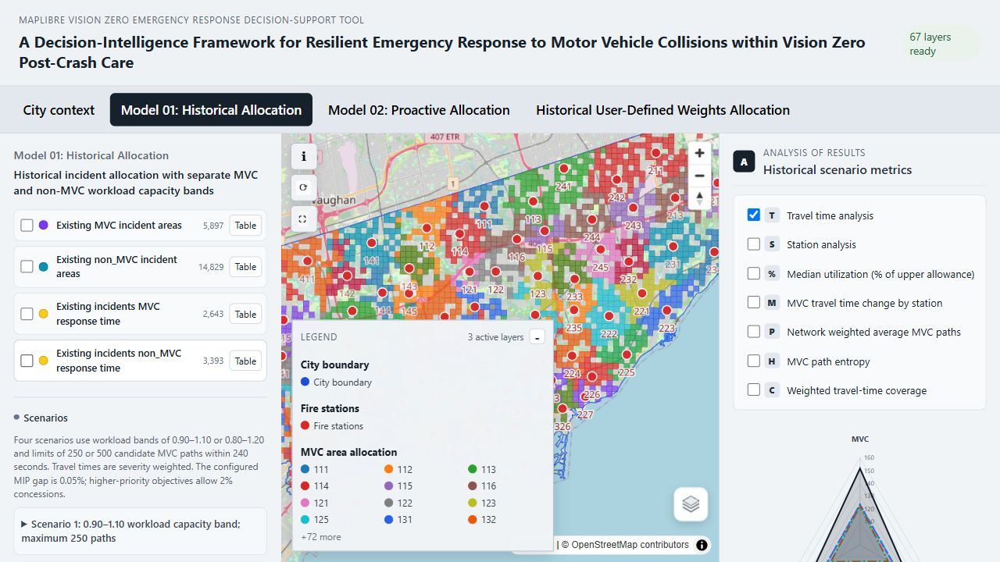

# Vision Zero Post-crash Care Webmap

This interactive tool was developed for the study **“A Decision-Intelligence Framework for Resilient Emergency Response to Motor Vehicle Collisions within Vision Zero Post-Crash Care.”** It supports the exploration of fire service allocation in Toronto, considering both motor vehicle collisions (MVCs) and non-MVC responsibilities.

Open the webmap

[Launch the Vision Zero Post-crash Care webmap](https://interactive-urban-mapping.github.io/Vision-Zero_Post-crash-Care/)

Users can inspect existing incident and response conditions, compare historical and Machine Learning-informed allocation scenarios, and examine travel time, capacity utilization, multi-path accessibility, weighted travel time coverage, and MVC path entropy. A browser-based manual solver also supports exploratory allocation using user-selected objective weights and upper workload limits; its results are approximate.



*Historical allocation workspace showing the Scenario 3 MVC allocation map and scenario analysis controls.*

## Main app source

`frontend` is the maintained source for both local use and deployment.

## Run locally

Requirements: Node.js 20 or newer and npm.

```powershell
cd frontend
npm ci
npm run dev
```

Open the local address printed by Vite. The browser-ready layers are included under `frontend/public/layers`, so no data-preparation step is required.

## Public repository scope

This repository is intentionally limited to the material required to build, understand, and display the public webmap:

- React, Vite, MapLibre, and browser-based optimization source code
- Browser-ready GeoJSON, raster, analysis, and manual-allocation inputs
- Data-source, licensing, and study documentation
- The retained `data/Original Data` source reference

## Build for deployment

```powershell
cd frontend
npm ci
npm run build
```

The production website is generated in `frontend/dist`. The GitHub Actions workflow publishes only that directory, keeping the deployed site well below GitHub Pages' 1 GB site limit.

## Data attribution

Contains information licensed under the [Open Government Licence - Toronto](https://open.toronto.ca/open-data-licence/).

- [City of Toronto Open Data Portal](https://open.toronto.ca/)
- [City of Toronto Vision Zero](https://www.toronto.ca/services-payments/streets-parking-transportation/road-safety/vision-zero/safety-measures-and-mapping/)

The source data were cleaned, aggregated, transformed, and used to produce derived analytical layers and model outputs. The City of Toronto does not endorse this project or its results. See `DATA_LICENSE.md` for the full data notice.

## Licence

The project software is available under the [MIT License](LICENSE). Data and third-party materials remain subject to the terms described in `DATA_LICENSE.md`.

